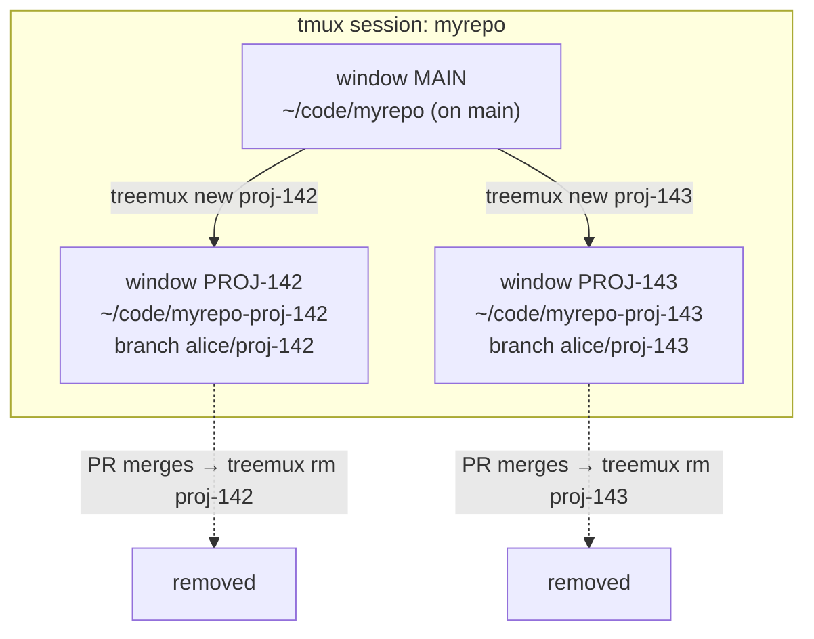

# treemux

One command per piece of work: an isolated git worktree on its own branch, a
tmux window, and a coding-agent session — created together, torn down together.

Instead of `git checkout`-ing between branches in one directory (which forces you
to stash, rebuild dependencies, and lose your place), every piece of work gets
its **own checkout on disk**. A long-running agent session, a dev server, and
your editor can all stay open per worktree and never collide.



- **One tmux session per repository**, named after its config, holding every
  window treemux opens for it.
- **One base window** sits in the main checkout, parked on the base branch. Use it
  to spawn new work and ask general questions — never for feature work. It is the
  first row of every listing and of the `resume` menu, so it is one keystroke away
  from wherever you are.
- **Each worktree** is a checkout (`myrepo-<slug>`) on a branch (`<prefix><slug>`),
  with a window in that session named after its ticket.
- **When the PR merges**, one command tears all three down together — and refuses
  if that would lose work.

## Install

```sh
brew install jay-snyder/tap/treemux
```

The cask installs `git` and `tmux` alongside it, and clears the quarantine flag
macOS would otherwise set on an unsigned download.

It is macOS-only, so on Linux use Go, or one of the tarballs attached to a
[release](https://github.com/jay-snyder/treemux/releases):

```sh
go install github.com/jay-snyder/treemux@latest
```

Or build from a clone:

```sh
git clone https://github.com/jay-snyder/treemux && cd treemux
go build -o treemux . && mv treemux ~/bin/    # anywhere on your PATH
```

### Shell integration

treemux is a compiled binary, so it runs in its own process and cannot change
your shell's working directory on its own. A small wrapper function closes that
gap, and also wires up tab completion. Add one line to your shell's startup file:

```sh
eval "$(treemux shell-init zsh)"     # ~/.zshrc
eval "$(treemux shell-init bash)"    # ~/.bashrc
treemux shell-init fish | source     # ~/.config/fish/config.fish
```

Two things need it. `treemux cd` moves your shell into a worktree, and after
`treemux rm` deletes the worktree you were standing in, your shell would
otherwise be left in a directory that no longer exists — with the integration it
moves you to the main checkout automatically. Everything else works either way;
without it, treemux prints the `cd` for you to run.

If a shell function named `treemux` already exists in your shell — migrating from
a shell-script predecessor, say — write the eval as `eval "$(command treemux
shell-init zsh)"`. `command` skips functions and aliases, so the line cannot ask
the thing being replaced for its own replacement.

### tmux integration

treemux runs your agent as the tmux window's own command, so a worktree's pane *is*
the agent: there is no shell in it to type `treemux resume` into. Reaching treemux
from inside a worktree meant splitting a pane or going to find a window that has a
prompt. A key binding that opens treemux in a popup closes that gap. Add one line
to `~/.tmux.conf`:

```tmux
run-shell 'treemux tmux-init --apply'
```

tmux has no equivalent of `eval "$(...)"`, so the binary loads the snippet itself.
To read it first, and keep it as a file of your own to edit:

```sh
treemux tmux-init > ~/.config/treemux/treemux.tmux
```

```tmux
source-file ~/.config/treemux/treemux.tmux
```

Both load the same text, which binds two keys tmux itself leaves free:

| Key | What it does |
|---|---|
| `prefix + T` | Pick a worktree and switch to it, in a popup over whatever is running. |
| `prefix + N` | Ask for a slug, then create the worktree. |

It also turns terminal titles on, and documents the window options treemux records
for a status line to read. Unlike the shell integration, which can only be
inferred, this one can be asked about: `treemux doctor` reports whether any key
binding reaches treemux, because a binding is a thing the server holds.

Both bindings go through `treemux popup`, which works out how big the popup needs
to be before opening it. tmux fixes a popup's size at creation and `-w`/`-h` take
only cells or a percentage of the terminal — and a percentage is the wrong unit
for a picker, whose height is the number of worktrees and whose width is the widest
slug. Neither grows when the terminal does, so on a wide screen a proportional
popup is mostly empty: three worktrees need 83×8, where 70%×60% of a 237×62 terminal
is 165×37, ten times the area. The bindings also pass `#{client_tty}`, because a
command run from `run-shell` has no association with the client that triggered it
and tmux would otherwise draw the popup over whichever terminal had been busier.

**Moving the keys.** Being unbound is the smaller half of choosing a key; the
larger half is what a missed shift does, since these get reached for in a hurry.
`t` is clock-mode and `n` is next-window, both harmless. But your config is yours,
and plenty of people rebind those — so pass the keys instead of editing after the
fact, and both ways of loading stay identical:

```sh
treemux tmux-init --resume-key G --new-key C-n
```

An empty key omits its binding, so `--new-key ""` binds only the picker. Keys are
letters, digits, dashes and underscores, which covers `G`, `C-n`, `M-Left` and
`F5`; anything with punctuation tmux reads as config syntax is refused, and
writing that binding by hand in the printed file is the way to have it. Anything
deeper than the keys — the popup's size, a binding of your own — is what printing
to a file is for.

> The first version of this bound `prefix + W`, for the mnemonic with tmux's own
> `w` window picker. Stock tmux has `w` as `choose-tree`, which is harmless — but
> a great many configs rebind lowercase `w` to `kill-window`, and there a missed
> shift destroys the very window the binding exists to reach. Hence `T`, and hence
> the flags.

## Get started

Inside the repository you want to work on:

```sh
treemux setup      # writes a config for this repo, guessing what it can
treemux doctor     # checks tmux, the shell integration, and every config
```

`setup` detects the main checkout, reads the base branch from `origin/HEAD`,
derives a branch prefix from your git email, and proposes any gitignored `.env`
files worth carrying into new worktrees. It reports every guess and writes them
as commented TOML — the file is the record, so anything wrong is one edit away.
Use `--dry-run` to see it without writing it.

From there the loop is four commands:

```sh
treemux new eng-142-white-screen   # worktree, branch, and a window running your agent
treemux ls                         # where every worktree stands
treemux cd eng-142                 # jump between them
treemux rm eng-142                 # when the PR merges
```

## One session per repository

Every repository's windows live in a tmux session of its own, named after its
config: the base window in the main checkout, and one window per worktree beside it.

```
tmux session "myrepo"                        tmux session "api-gateway"
├── MAIN     ~/code/myrepo                   ├── MAIN     ~/code/api-gateway
├── ENG-142  ~/code/myrepo-eng-142           └── API-7    ~/code/api-gateway-api-7
└── ENG-143  ~/code/myrepo-eng-143
```

Two repositories sharing one session reads badly, which is what this exists to
prevent: both have a window called `MAIN`, a ticket key alone does not say which
checkout it belongs to, and a `treemux ls` for one repository describes windows
sitting next to another's.

What follows from it:

- **`new` creates the session** when it is not running yet, so the first command
  of the day is what establishes it. `resume` and `base` do the same.
- **`base` is the same window every time.** A window already sitting in the main
  checkout is selected rather than a second one opened beside it — and being the
  session's first window, it is what keeps the session alive as worktrees come and go.
- **Commands follow their window across sessions.** Resuming a worktree while
  attached to another repository's session switches you there.
- **Outside tmux nothing is skipped.** The session and window are created
  detached, and treemux says to run `treemux attach` to reach them — its own
  command rather than a `tmux attach` to copy, because that spelling names the
  session exactly and finds the right server under `TREEMUX_TMUX_LABEL`.
- **A window in the wrong session is used rather than duplicated** — one you
  opened by hand, or one from before the repository had a session. `ls` shows it as
  `session:window`, and `resume` switches to it there.

`tmux_session` overrides the session name, for a name already taken by something
else or two repositories that deliberately want to share one. `treemux doctor`
reports which session each repository maps to, and warns when two configs name the
same one.

`TREEMUX_TMUX_LABEL` aims treemux at a non-default tmux server, the way `tmux -L`
does. Inside tmux nothing needs it: treemux reaches the server it is running under
through `$TMUX`.

### Terminal and tab titles

Attaching tends to leave the terminal and tab titled with the command line that
attached rather than with the session. tmux is not the one writing it:
`set-titles` is off by default, so tmux never sets a title at all, and whatever
the shell wrote before it started — under kitty, iTerm2 or any terminal with shell
integration, the command being run — stays there until the next prompt, which
inside tmux never comes.

`treemux tmux-init` turns it on, which is the one thing in that snippet not about
treemux:

```tmux
set -g set-titles on
set -g set-titles-string "#S: #W"
```

`#S` is the session, so the repository, and `#W` the window, so the worktree — the
repository and the worktree rather than the repository alone. Delete those two
lines from the snippet if you set your own format.

It is set there rather than by treemux itself, per session, for two reasons.
Session options are set with `set-option -t`, whose target does not accept tmux's
exact-match `=name` form, so treemux would be back to the prefix matching the rest
of this section avoids. And a title format is yours: a file you loaded on purpose
can change it, a `treemux new` should not.

### What treemux records on a window

Every window treemux opens carries the worktree it belongs to, as tmux user options,
so a status line can name it without shelling out to git on every interval:

| Option | Value |
|---|---|
| `@treemux_repo` | The config's name. |
| `@treemux_worktree` | The checkout the window was opened on. |
| `@treemux_slug` | The worktree. Unset on the base window, which is not one. |
| `@treemux_branch` | The branch that worktree is on. |

Only the worktree is read back by treemux, and for a reason worth knowing: it is
what identifies a window. A pane's directory moves with every `cd`, and two
windows can stand in one directory at once — the base window does exactly that
after `treemux cd` — so which window a worktree owns cannot be read off where its
shell happens to be standing.

They are written when the window is created, so a window treemux merely finds and
switches to keeps whatever it already had.

## Configure

One TOML file per repository, in
`${TREEMUX_CONFIG_DIR:-${XDG_CONFIG_HOME:-~/.config}/treemux/repos}/<name>.toml`.
`treemux setup` writes one; the rest of this section is what it contains, and
`treemux config` prints what is in force for the repo you are standing in,
defaults included.

The file's name is what you pass to `treemux ls <name>`.

```toml
main_dir      = "~/code/myrepo"   # required: the main checkout
base_branch   = "staging"         # fork from and compare against this (default "main")
branch_prefix = "alice/"          # <prefix><slug> is the branch name (default none)

# Gitignored files a fresh checkout lacks but the app needs.
carry_files = ["apps/api/.env", ".env.local"]

command        = "claude"              # launched by `new` and `base`
resume_command = "claude --continue"   # launched by `resume`
post_create    = "npm install"         # run in the background after `new` (default none)
ticket_pattern = '(?i)^(proj-[0-9]+)'  # submatch 1 names the tmux window
tmux_session   = "work"                # session holding the windows (default: the config's name)
```

| Setting | Default | Purpose |
|---|---|---|
| `main_dir` | *required* | The repository's main checkout. Worktrees are its siblings, `<main_dir>-<slug>`. `~` and `$VAR` are expanded. |
| `base_branch` | `main` | New branches fork from `origin/<base_branch>`, and all status is measured against it. |
| `branch_prefix` | none | Prepended to the slug to form the branch name. |
| `carry_files` | none | Paths relative to `main_dir`, copied into each new worktree. |
| `command` | `claude` | What `new` and `base` launch in the tmux window. |
| `resume_command` | `claude --continue` | What `resume` launches. Set separately from `command`. |
| `post_create` | none | Shell command run in the new worktree, in the background. Output goes to `<main_dir>/.git/treemux/post-create-<slug>.log`. |
| `ticket_pattern` | `(?i)^([a-z]+-[0-9]+)` | Regexp whose first submatch names the tmux window. Non-matching slugs are truncated to 10 characters. |
| `tmux_session` | the config's name | The tmux session this repository's windows go in. Periods and colons become dashes, since tmux reads them as target separators. |

Unknown settings are an error rather than being silently ignored, so a
misspelled key tells you instead of quietly doing nothing.

treemux picks the config whose `main_dir` is the repository you are standing in —
which works from inside a worktree too. Outside any repository it uses the only
config, or the name you pass.

## Commands

| Command | What it does |
|---|---|
| `treemux new <slug> [window-name]` | Create a worktree and branch off the latest `origin/<base_branch>`, carry configured files in, and open a window on it in the repository's tmux session. |
| `treemux resume [slug]` | Reopen a window on an existing worktree, or switch to the one already open. Menu when the slug is omitted, with the base checkout at the top of it. |
| `treemux cd [slug]` | Move your shell into a worktree, or into the main checkout with `base`. Menu when the slug is omitted. |
| `treemux base [repo]` | Select the base window on the main checkout, opening it if it is not there. |
| `treemux attach [repo]` | Attach this terminal to a repository's tmux session, on whichever window was current there. Moves the client instead when already inside tmux. |
| `treemux popup [-c <client>] <command>` | Run a treemux command in a tmux popup sized to its output. What the `tmux-init` key bindings go through. |
| `treemux ls [--json] [repo]` | List worktrees with status, divergence, and the tmux window open in each. Changes no working tree, branch, or ref. |
| `treemux rm [-f] [-y] <slug>` | Tear down the worktree, branch, and stale remote ref, and offer to close its tmux window. Refuses when work would be lost, unless `--force`. |
| `treemux prune [-y] [repo]` | Remove every merged, clean worktree. Lists them without `--yes`. |
| `treemux setup [-n] [name]` | Write a config for the repository you are standing in, detecting what it can. |
| `treemux config [repo]` | Print the settings in force, defaults included, and the file they came from. |
| `treemux doctor` | Check the installation and every registered config. Exits non-zero on a failure. |
| `treemux shell-init <shell>` | Print the shell integration for zsh, bash, or fish. |
| `treemux tmux-init [--apply] [--resume-key <key>] [--new-key <key>]` | Print the tmux integration: popup key bindings and titles. `--apply` loads it into the running server instead. |

Run `treemux help <command>` for detail on any one of them.

A few commands answer to a second name, for when the first one is not what comes
to mind: `create` for `new`, `remove` and `delete` for `rm`, `list` and `status`
for `ls`, `main` and `home` for `base`, `reopen` for `resume`. Help lists only the
canonical name, so there is one spelling to learn and another that forgives you.
A name that is close to a command but not one gets pointed at the nearest match.

### The base checkout is in the menu

`resume` and `cd` list the main checkout above the worktrees, under the branch it
is parked on. It belongs there on both of the list's own terms: it is where you
land between worktrees — investigating, reviewing a pull request, asking an agent
to start the next piece of work — and, since a tmux session does not survive a
reboot while a checkout on disk does, it is something you reopen. Left out of the
list, the one window that is always there, and that keeps the session alive, was
the one window the resume key could not reach.

It is not a worktree, and nothing pretends otherwise. `rm` and `prune` work off
the worktrees treemux created, so neither can name it; `ls --json` flags its row
with `"base": true` for anything reading the listing to decide where work should
go. Name it `base`, or name the branch it is on.

Two ways in, one window. `treemux base` opens it fresh with `command`; picking it
out of the resume menu runs `resume_command`, the same "carry on where I left off"
every other row gets — which after a reboot is the point. The difference shows
only on the first open, since every later call finds the window by its directory
and switches to it.

### Naming a worktree

`rm`, `resume` and `cd` take an unambiguous prefix of a slug, because a slug
carries both a ticket key and a description while people refer to that work by the
key alone:

```
$ treemux cd eng-1646
eng-1646 matches worktree eng-1646-app-landing-page-redesign
```

The expansion is always reported rather than applied silently — `rm` is on that
list. An exact slug wins over any prefix, so a slug that is a prefix of another
stays reachable by its own name, and an ambiguous prefix is an error listing the
candidates rather than a guess.

`new` reuses a branch that already exists rather than recreating it, which is also
how you get a worktree onto a colleague's pull request after fetching it.

### Output contract

stdout carries the answer and nothing else, so any command can be piped:

| Command | stdout |
|---|---|
| `new` | the new worktree's path — `cd "$(treemux new eng-1)"` works |
| `cd` | the chosen worktree's path, so `cd "$(treemux cd eng-1)"` works unaided |
| `rm` | the removed worktree's path |
| `prune` | the paths it removed, or would remove |
| `ls` | the table, or a JSON array with `--json` |
| `setup` | the config file's path, or the config itself with `--dry-run` |
| `config`, `doctor` | the report you asked for |
| `shell-init`, `help`, `version` | the script or text you asked for |

Progress, warnings, prompts, and errors go to stderr, prefixed `warning:` or
`error:` when something is wrong and unprefixed when it is just narration. So
`treemux ls --json | jq` and `treemux prune --yes > removed.txt` both stay clean.

`ls` colors the status column when writing to a terminal, and stays plain when
redirected or when `NO_COLOR` is set. `--json` reports `ahead` and `behind` as
`null` rather than `0` when the branch cannot be compared to its base, and
describes an open window with three fields: `window` is its name, `window_id` is
what `tmux kill-window -t` takes, and `window_session` is what `tmux attach -t`
takes. All three are empty strings when no window is open.

Exit codes: `0` success, `1` the command ran and failed, `2` it was invoked wrong.
`doctor` exits `1` when a check fails, so it can gate a setup script.

A branch always forks from `origin/<base_branch>`. There is deliberately no flag
to base one on anything else — the point is that every worktree starts from the
same known-current place. When origin is unreachable, `new` says so and forks
from the local base branch instead.

A slug becomes both a directory name and a branch name, so it may not contain `/`
— a nested one would leave a stray parent behind when the worktree is removed —
and it is checked up front against the rest of git's branch-naming rules, so a
slug with a space in it is one sentence rather than several lines of git's advice
about ref formats. If you pass a slug that already starts with your
`branch_prefix`, treemux strips it and says so, rather than producing
`alice/alice/proj-142`.

### Statuses

`ls` reports one status per worktree, in this precedence:

| Status | Color | Meaning |
|---|---|---|
| `dirty (n)` | yellow | `n` uncommitted files. Outranks everything, because it is the most easily lost. |
| `merged` | green | The work has landed in `origin/<base_branch>`. Safe to remove; `prune` reaps these. |
| `unpushed (n)` | red | `n` commits exist only in this worktree. `rm` refuses without `--force`. |
| `active` | cyan | Pushed but not merged — an open pull request. `prune` never touches these. |
| `base (n)` | dim | The main checkout, which is not a worktree and is never removed. `n` counts uncommitted files when there are any. |

The first four answer one question — how safe is this to throw away — and `base`
is deliberately outside that scale, because none of their answers is true of the
main checkout. A base checkout sitting level with origin has no commits outside
it, which would read as `merged`: the green that means "safe to delete", about the
one directory that must never go.

Its divergence column is still worth reading, and means something slightly
different: measured against `origin/<base_branch>` as every row is, for the
checkout parked on that branch it is how far behind origin you are — whether the
investigation or the review you are doing there is against a stale tree.

The counts are the numbers `rm` refuses over, so a listing says how much a
`--force` would discard. The worktree you are standing in is marked with an
asterisk, and that column appears only when one of the rows is in fact where you
are — which now includes standing in the main checkout.

`ls` does not fetch — it changes no ref — so a branch that landed since your last
fetch still reads as `active`. `rm` and `prune` both fetch before they judge, and
so can disagree with a stale listing; they are the ones to trust.

**Squash merges are recognized.** When a forge squash-merges a PR, the branch's
own commits never land upstream — they are collapsed into one new commit and the
remote branch is deleted. A naive "are these commits upstream?" check would call
that landed work unpushed and refuse to clean it up. treemux instead synthesizes
a single commit holding the branch's whole tree on top of its merge-base — the
same patch a squash merge produces — and asks `git cherry` whether an equivalent
patch is already upstream.

That synthetic commit is written to the object database as a dangling object, so
treemux needs write access to `.git` even for commands that only report. Its
author, committer, and dates are fixed, so its hash depends only on the tree and
parent being tested: repeated runs reuse the same object rather than leaving a
new one behind each time, and `git gc` reaps it.

## Safety

`rm` refuses, absent `--force`, when the worktree has uncommitted changes or
commits reachable from no origin ref. It refreshes `origin/<base_branch>` first,
so a branch that merged moments ago is recognized as merged rather than tripping
the guard on a stale ref. `prune` only ever targets worktrees that are both
merged and clean.

A destructive command never acts on a name it had to guess at: a slug prefix must
match exactly one worktree, the expansion is printed, and anything ambiguous or
unknown is an error naming the alternatives. `setup` will not overwrite an existing
config, or add a second one for a repository already registered.

Removing a worktree leaves its tmux window pointing at a directory that is gone,
so `rm` offers to close it — the window named after the worktree, identified from the
worktree's own path rather than from wherever you ran the command, and closed even
when it turns out to be in another session or when you are not in tmux at all.
`prune` asks per worktree it removed. Neither closes a window without asking unless
you pass `--yes` to `rm`, because a window may still have a session running in it;
with nobody to prompt, both print the `tmux kill-window` to run instead.

Closing a session's last window ends the session, which moves an attached client
elsewhere or detaches it, so the prompt says when that is what is about to happen.
Normally it is not: the base window outlives every worktree.

## Development

```sh
go test ./...        # unit and end-to-end tests, against throwaway repos
go vet ./...
gofmt -l .           # should print nothing
```

The tests build real git repositories in temp directories and drive the
subcommands end to end, including the squash-merge case, the removal guards, and
the shell shims — each emitted shim is syntax-checked by the shell it targets.

The tmux integration is tested against a real tmux server, private to each test:
its own socket directory, its own server, killed afterwards, so a developer's own
sessions and windows are never touched. Tests that need one skip when tmux is not
installed, which is why CI installs it. The emitted tmux config is loaded into one
of those servers and then read back out of it — the same check the shell shims get
from their own shells, and for the same reason: a snippet that does not parse
would break the startup of the thing it is loaded into.

Layout:

| Package | Responsibility |
|---|---|
| `internal/git` | Every git operation, including the merged/unpushed/dirty logic. |
| `internal/config` | TOML loading and which config applies. |
| `internal/cli` | Subcommands, output formatting, and the eval-file protocol. |
| `internal/tmux` | The handful of tmux commands treemux drives. |
| `internal/ui` | The interactive picker and the table. |
| `internal/shellinit` | The zsh, bash, and fish integration snippets. |
| `internal/tmuxinit` | The tmux integration: key bindings and titles. |
