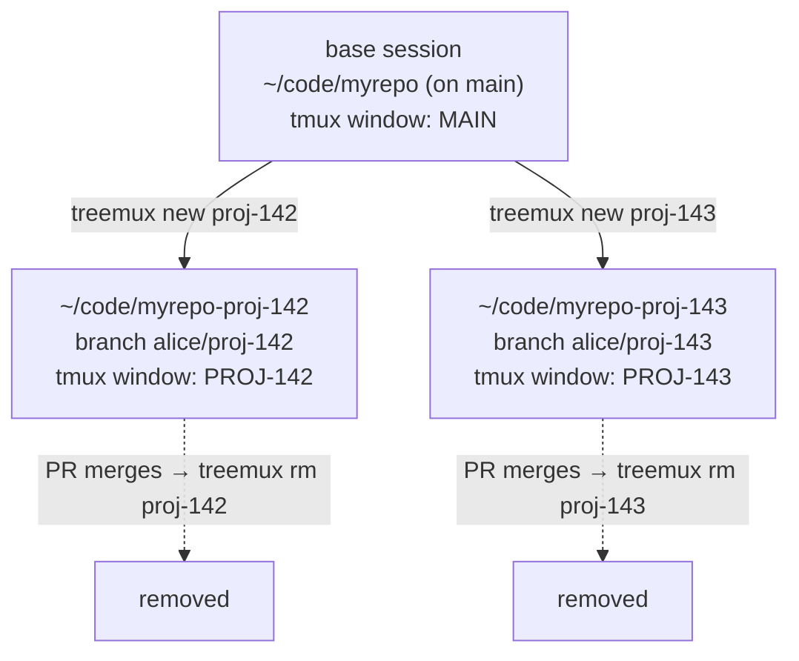

# treemux

One command per stream of work: an isolated git worktree on its own branch, a
tmux window, and a coding-agent session — created together, torn down together.

Instead of `git checkout`-ing between branches in one directory (which forces you
to stash, rebuild dependencies, and lose your place), every stream of work gets
its **own checkout on disk**. A long-running agent session, a dev server, and
your editor can all stay open per stream and never collide.



- **One base session** lives in the main checkout, parked on the base branch. Use
  it to spawn new work and ask general questions — never for feature work.
- **Each stream** gets a worktree (`myrepo-<slug>`), a branch (`<prefix><slug>`),
  and a tmux window named after its ticket.
- **When the PR merges**, one command tears the whole stream down — and refuses
  if that would lose work.

## Install

```sh
go install github.com/jay-snyder/treemux@latest
```

Or build from a clone:

```sh
git clone https://github.com/jay-snyder/treemux && cd treemux
go build -o treemux . && mv treemux ~/bin/    # anywhere on your PATH
```

### Shell integration

treemux is a compiled binary, so it runs in its own process and cannot change
your shell's working directory on its own. A small wrapper function closes that
gap, and also wires up tab completion. Add one line to your shell's startup file:

```sh
eval "$(treemux init zsh)"     # ~/.zshrc
eval "$(treemux init bash)"    # ~/.bashrc
treemux init fish | source     # ~/.config/fish/config.fish
```

Everything works without the integration except one thing: after `treemux rm`
deletes the worktree you were standing in, your shell would be left in a
directory that no longer exists. With the integration it moves you to the main
checkout automatically; without it, treemux prints the `cd` for you to run.

## Configure

One TOML file per repository, in
`${TREEMUX_CONFIG_DIR:-${XDG_CONFIG_HOME:-~/.config}/treemux/repos}/<name>.toml`.
The file's name is what you pass to `treemux ls <name>`.

```toml
main_dir      = "~/code/myrepo"   # required: the main checkout
base_branch   = "staging"         # fork from and compare against this (default "main")
branch_prefix = "alice/"          # <prefix><slug> is the branch name (default none)

# Gitignored files a fresh checkout lacks but the app needs.
carry_files = ["apps/api/.env", ".env.local"]

command        = "claude"              # launched by `new` and `base`
resume_command = "claude --continue"   # launched by `resume`
post_create    = "npm install"         # run in the background after `new` (default none)
ticket_pattern = '(?i)^(proj-[0-9]+)'  # submatch 1 names the tmux window
```

| Setting | Default | Purpose |
|---|---|---|
| `main_dir` | *required* | The repository's main checkout. Worktrees are its siblings, `<main_dir>-<slug>`. `~` and `$VAR` are expanded. |
| `base_branch` | `main` | New branches fork from `origin/<base_branch>`, and all status is measured against it. |
| `branch_prefix` | none | Prepended to the slug to form the branch name. |
| `carry_files` | none | Paths relative to `main_dir`, copied into each new worktree. |
| `command` | `claude` | What `new` and `base` launch in the tmux window. |
| `resume_command` | `claude --continue` | What `resume` launches. Set separately from `command`. |
| `post_create` | none | Shell command run in the new worktree, in the background. Output goes to `<main_dir>/.git/treemux/post-create-<slug>.log`. |
| `ticket_pattern` | `(?i)^([a-z]+-[0-9]+)` | Regexp whose first submatch names the tmux window. Non-matching slugs are truncated to 10 characters. |

Unknown settings are an error rather than being silently ignored, so a
misspelled key tells you instead of quietly doing nothing.

treemux picks the config whose `main_dir` is the repository you are standing in —
which works from inside a worktree too. Outside any repository it uses the only
config, or the name you pass.

## Commands

| Command | What it does |
|---|---|
| `treemux new <slug> [window-name]` | Create a worktree and branch off the latest `origin/<base_branch>`, carry configured files in, and open a tmux window in it. |
| `treemux rm [-f] [-y] <slug>` | Tear down the worktree, branch, and stale remote ref. Refuses when work would be lost, unless `--force`. |
| `treemux ls [--json] [repo]` | List worktrees with status, divergence, and whether a tmux window is open in each. Changes no working tree, branch, or ref. |
| `treemux prune [-y] [repo]` | Remove every merged, clean worktree. Lists them without `--yes`. |
| `treemux resume [slug]` | Reopen a window on an existing worktree. Menu when the slug is omitted. |
| `treemux base [repo]` | Open a window on the main checkout. |
| `treemux init <shell>` | Print the shell integration for zsh, bash, or fish. |

Run `treemux help <command>` for detail on any one of them.

### Output contract

stdout carries the answer and nothing else, so any command can be piped:

| Command | stdout |
|---|---|
| `new` | the new worktree's path — `cd "$(treemux new eng-1)"` works |
| `rm` | the removed worktree's path |
| `prune` | the paths it removed, or would remove |
| `ls` | the table, or a JSON array with `--json` |
| `init`, `help`, `version` | the script or text you asked for |

Progress, warnings, prompts, and errors go to stderr, prefixed `warning:` or
`error:` when something is wrong and unprefixed when it is just narration. So
`treemux ls --json | jq` and `treemux prune --yes > removed.txt` both stay clean.

`ls` colors the status column when writing to a terminal, and stays plain when
redirected or when `NO_COLOR` is set. `--json` reports `ahead` and `behind` as
`null` rather than `0` when the branch cannot be compared to its base.

Exit codes: `0` success, `1` the command ran and failed, `2` it was invoked wrong.

A branch always forks from `origin/<base_branch>`. There is deliberately no flag
to base one on anything else — the point is that every stream starts from the
same known-current place. When origin is unreachable, `new` says so and forks
from the local base branch instead.

A slug may not contain `/`. It becomes a directory name, and a nested one would
leave a stray parent behind when the worktree is removed. If you pass a slug that
already starts with your `branch_prefix`, treemux strips it and says so, rather
than producing `alice/alice/proj-142`.

### Statuses

`ls` reports one status per worktree, in this precedence:

| Status | Color | Meaning |
|---|---|---|
| `dirty` | yellow | Uncommitted changes. Outranks everything, because it is the most easily lost. |
| `merged` | green | The work has landed in `origin/<base_branch>`. Safe to remove; `prune` reaps these. |
| `unpushed` | red | Commits exist only in this worktree. `rm` refuses without `--force`. |
| `active` | cyan | Pushed but not merged — an open pull request. `prune` never touches these. |

**Squash merges are recognized.** When a forge squash-merges a PR, the branch's
own commits never land upstream — they are collapsed into one new commit and the
remote branch is deleted. A naive "are these commits upstream?" check would call
that landed work unpushed and refuse to clean it up. treemux instead synthesizes
a single commit holding the branch's whole tree on top of its merge-base — the
same patch a squash merge produces — and asks `git cherry` whether an equivalent
patch is already upstream.

That synthetic commit is written to the object database as a dangling object, so
treemux needs write access to `.git` even for commands that only report. Its
author, committer, and dates are fixed, so its hash depends only on the tree and
parent being tested: repeated runs reuse the same object rather than leaving a
new one behind each time, and `git gc` reaps it.

## Safety

`rm` refuses, absent `--force`, when the worktree has uncommitted changes or
commits reachable from no origin ref. It refreshes `origin/<base_branch>` first,
so a branch that merged moments ago is recognized as merged rather than tripping
the guard on a stale ref. `prune` only ever targets worktrees that are both
merged and clean.

## Development

```sh
go test ./...        # unit and end-to-end tests, against throwaway repos
go vet ./...
gofmt -l .           # should print nothing
```

The tests build real git repositories in temp directories and drive the
subcommands end to end, including the squash-merge case, the removal guards, and
the shell shims — each emitted shim is syntax-checked by the shell it targets.

Layout:

| Package | Responsibility |
|---|---|
| `internal/git` | Every git operation, including the merged/unpushed/dirty logic. |
| `internal/config` | TOML loading and which config applies. |
| `internal/cli` | Subcommands, output formatting, and the eval-file protocol. |
| `internal/tmux` | The handful of tmux commands treemux drives. |
| `internal/ui` | The interactive picker. |
| `internal/shellinit` | The zsh, bash, and fish integration snippets. |
